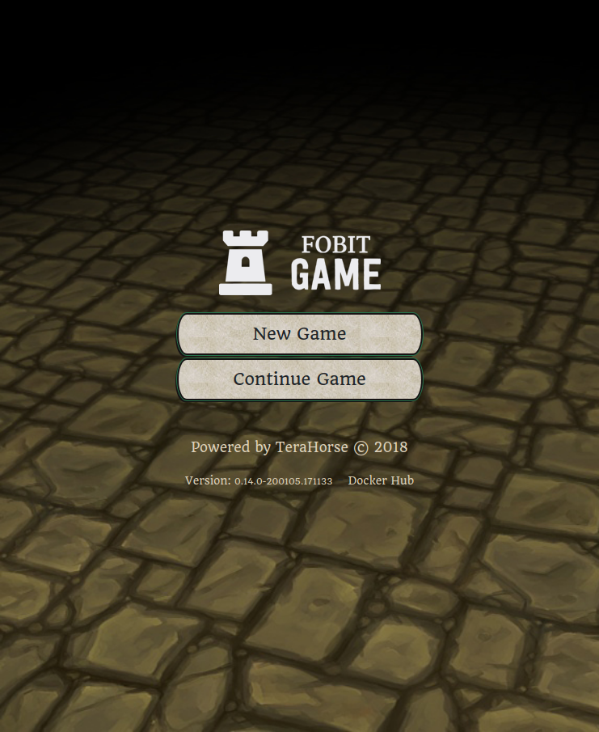
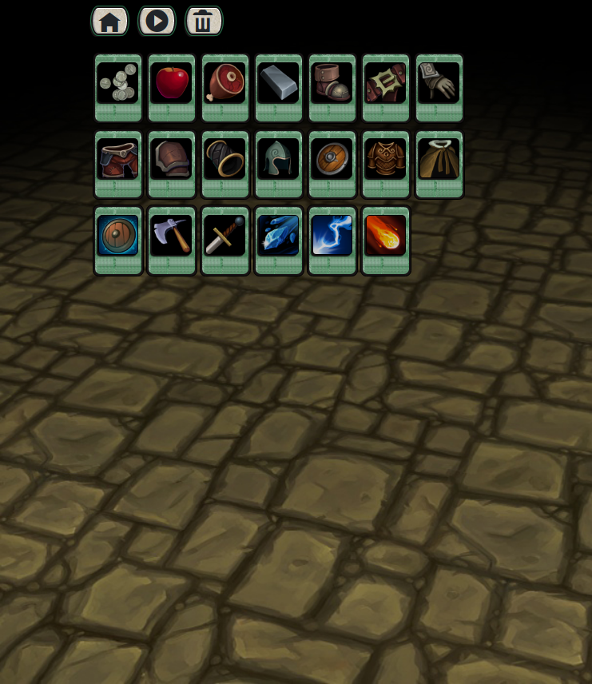
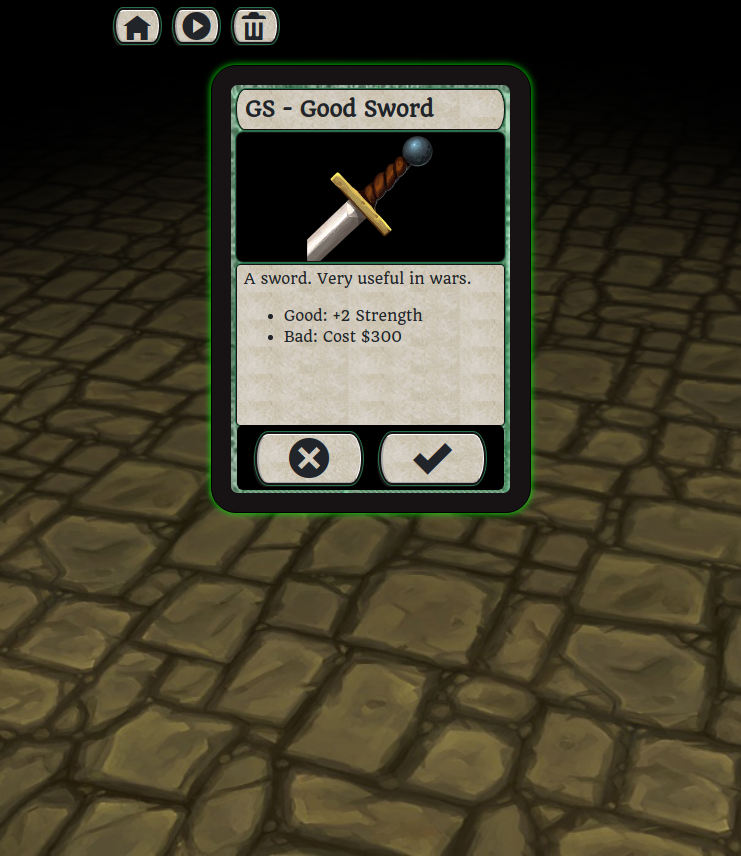
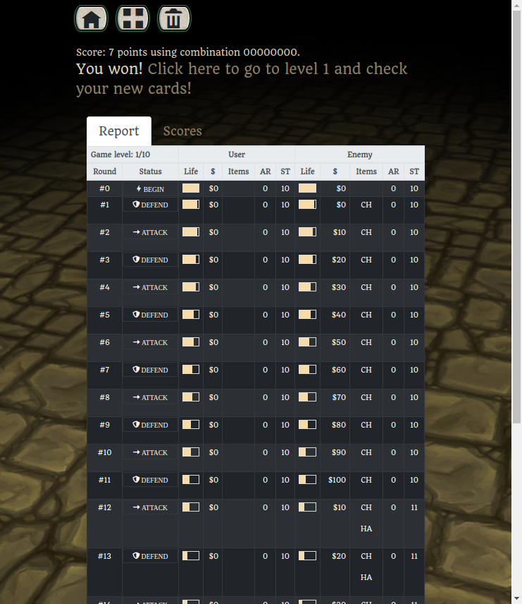

# The Fobit Game

## Note
This is an **unreleased** RPG card game that was **abandoned** because it was, well, boring.
However, this code can be used as example in many areas:

* Drools: this game uses Drools as its rules engine, to process cards effects
* Gradle: you can find many Gradle files, ready to be used on contexts like Docker and AWS
* Docker: a sample docker image and commands to publish a image on DockerHub
* Jenkins: steps to configure Jenkins from scratch including a Jenkinsfile (for Jenkins Pipeline)
* Nginx: a reverse proxy server with a small example config on nginx.conf
* AWS: some basic operations on AWS
* SASS: to create custom css
* AngularJS: as front-end js technology
* Springboot: as server-side technology

## Screenshots
Main screen

Card selection screen

Card details

Battle screen

## Intro
In this game you have 32 yes/no decisions to take. You can think a lot and won the game.

Or you can try 4 billion times (2^³²) and won the game as well.

Note: this game was abandoned. If you copy and paste something from here, please give us credits ;)

## How to play locally compiling source code
* Install Java 8 or higher
* Install sass using ruby installer (gem)
    * Note: dont use Ubuntu package (*sudo apt install sass*). It will not work. Use the following commands:
     
        $ sudo apt install -y ruby-dev gcc automake libtool rubygems build-essential
        
        $ sudo gem install sass
* Compile and run the server with:
    * ./gradlew
* Access http://localhost:5000

## How to play anywhere using docker
* Install [Docker](https://docs.docker.com/install)
* Run `$ sudo docker run -d -p 80:5000 --name fobit terahorse/fobit`
* Access http://localhost

## Docker Images

Each release is launched at our [Docker Hub page](https://hub.docker.com/r/terahorse/fobit/tags/).
You can check also our releases notes in the CHANGELOG.md file.

## Rest API
| Call | Method | Description | Example |
| --- | --- | --- | --- |
| **/api/version** | GET | Gets current version | */api/version* |
| **/api/battle/{cardsCode}** | GET | Starts a new battle | */api/battle/0*, */api/battle/FFCCDD* |

## Technical Notes
* Front-end: JavaScript, AngularJS 1.6.9, Bootstrap 4.1.1, SASS 1.7.0
* Back-end: Java 1.8.0, Spring Boot 2.0.1, Drools 7.7.0
* Build system: Gradle 4.8
* Unit/Integration tests: Spock/Groovy
* Continuous Integration: Jenkins
* Code quality: SonarCloud